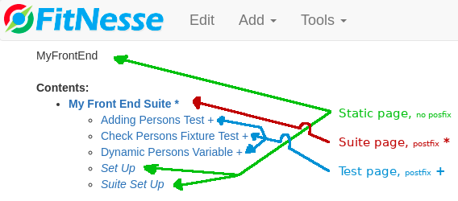

# Fitnesse
FitNesse is a test framework that lets us write tests in table-style, thereby letting domain knowledge people (non coders) write acceptance tests in wiki-format. It's not meant to be used as a replacement to unit tests, but rather an addition that can help with acceptance tests. The tests can be manually run on a standalone FitNesse server or as part of the build process.

FitNesse tests are written in wiki-files as wiki tables. For these tests to actually test / interact with our code, we must also write Java-`fixture`-code that acts as a bridge between our wiki-tests and our business code. A simple test can look something like this:
```
|eg.Division|
|numerator  |denominator|quotient?  |
|10         |2          |5          |
```

There are two differnet "test-runners" for FitNesse, `Slim` and `Fit`. In short, `Fit` seems to be an old runner and we should therefore prefer to use `Slim`, therefore `Fit` isn't covered here.

See my sample repo [FitNesseSample](http://github.com/magnusjerre/FitNesseSample) for implementation examples.

# Table of contents
* [Slim](#Slim)
* [Fixtures](#Fixtures)
    * [Simple Division ficture example](#Simple-Division-fixture-example)
    * [Docker or shell fixture](#Docker-or-shell-fixture)
* [FitNesse structure](#FitNesse-structure)
    * [Create new "pages"](#Creating-new-"pages")
    * [Folder structure and wiki page structure](#Folder-structure-and-wiki-page-structure)
* [Special pages](#Special-pages)
* [Browser testing](#Browser-testing)
* [Quirks and other stuff](#Quirks-and-other-stuff)
* [Keywords](#Keywords)

# Slim 
[Slim](http://fitnesse.org/FitNesse.UserGuide.WritingAcceptanceTests.SliM) - Simple List Invocation Method: `Slim` is the underlying test system used for running the FitNesse tests. `Slim` searches in the java code for "test fixtures" corresponding to the code referenced in the test table, for instance the class `eg.Division` in the following example: 
```
!define TEST_SYSTEM {slim}

|eg.Division|
|numerator  |denominator|quotient?  |
|10         |2          |5          |
|22         |7          |~=3.14     |
|11         |2          |4<_<6      |
```
In order to use `Slim` we must include `!define TEST_SYSTEM {slim}` on either the wiki-test-page or on a wiki-page further up the chain. Note that it doesn't work if we define this variable in `SuiteSetUp` or `SetUp`. 
The following is a subset of the tables working with `Slim`:
* Decision Table - Supplies the inputs and outputs for decisions. This is similar to the Fit Column Fixture.
* Query Table - Supplies the expected results of a query. This is similar to the Fit Row Fixture. The fixture MUST contain the following method signature `public List<List<List<String>>> query()`.
* Subset Query Table - Supplies a subset of the expected results of a query.
* Script Table - A series of actions and checks. Similar to Do Fixture.
* Import - Add a path to the fixture search path.
* Scenario Table - A table that can be called from other tables.
* Library Table - A table that installs fixtures available for all test sub-pages. Library is a reserved word.
* Define Alias - A helper table that defines alias names for fixtures.

# Fixtures
The `fixture`-code is the bridge between our wiki pages and our business code. The fixtures should be as thin as possible, ideally doing only `piping and wiring` from test data to the business code.
## Simple Division fixture example
The following table defines a set of three "unit-tests". The tests verifies the divison of the `numerator` by the `denominator` by comparing the value of `quotient` with its column inputs. The `?` indicates to the FitNesse table that we should compare the cell value with the output of `quotient` from the fixture.
```
!define TEST_SYSTEM {slim}

|eg.Division|
|numerator  |denominator|quotient?  |
|10         |2          |5          |
|22         |7          |~=3.14     |
|11         |2          |4<_<6      |
```
The following fixture code is called by `Slim` when the test is run.
```java
package eg;

public class Division {
  private double numerator, denominator;
  
  public void setNumerator(double numerator) {
    this.numerator = numerator;
  }
  
  public void setDenominator(double denominator) {
    this.denominator = denominator;
  }
  
  public double quotient() {
    return numerator/denominator;
  }
} 
```
## Docker or shell fixture
There is not built-in fixture support for docker or shell commands in FitNesse. There might be a plugin for this (I haven't check), but it's fairly easy to implement this ourselves. The following example illustrates how to create and use a fixture that interacts with `bash`.
```java
package jerre.fixture;

import java.io.BufferedReader;
import java.io.IOException;
import java.io.InputStreamReader;

//Java fixture code for interacting with the shell
public class Shell {
    private String latestShellResult;
    public void echo(String stringToEcho) throws IOException {
        String[] args = new String[] {
          "/bin/bash", "-c", "echo " + stringToEcho
        };
        final ProcessBuilder processBuilder = new ProcessBuilder(args);
        final Process start = processBuilder.start();

        try (BufferedReader reader = new BufferedReader(new InputStreamReader(start.getInputStream()))){
            latestShellResult = reader.readLine();
        }
    }
    public String latestShellResultIs() {
        return latestShellResult;
    }
}
```
This is the corresponding FitNesse table using the shell fixture.
```wiki
|script|shell                             |
|echo  |hello world                       |
|check |latest shell result is|hello world|
```
# FitNesse structure
## Creating new "pages"
The easiest way to create a new page is by using the `Add`-button on the webpage. We can create three different kinds of pages, `Static page`, `Suite page` and `Test page`. Only `Suite page` and `Test page`can actually run tests. A page's type can be changed through the `Properties`-button.
### Static page
A page than can't be run. Typically groups one or more tests / test suites. The [special pages](#Special-pages) such as `SuiteSetUp` and `SetUp` should be of this type.
En side som ikke kan kjøres. Dette vil f.eks være en side som grupperer en eller flere tester / suites. Spesial sidene som SuiteSetup og SetUp bør være denne typen side.
### Suite page
A `Suite Page` is a collection of tests and can be run by pressing `t`on the keyboard or the `Suite` button at the top of the screen. A folder will be created for the suite when adding tests to it.
### Test page
A `Test Page` represents a single test and can be run by pressing `t`on the keyboard or the `Suite` button at the top of the screen.

## Folder structure and wiki page structure
Old FitNesse projects used a combination of folders, content.txt and properties.xml files, newer projects however use folders and wiki-files. The example below shows only a subset of the folder structure in `FitNesseRoot`.
```
FitNesseRoot
|-- MyFrontEnd.wiki
|   MyFrontEnd
|   |-- MyFrontEndSuite.wiki
|   |   MyFrontEndSuite
|   |   |-- AddingPersonsTest.wiki
|   |   |-- CheckPersonsFixtureTest.wiki
|   |   |-- DynamicPersonsVariable.wiki
|   |   |-- SetUp.wiki
|   |   |-- SuiteSetUp.wiki
```
The following image is shows the corresponding structure in FitNesse web view.


# Special pages
[Here](http://fitnesse.org/FitNesse.UserGuide.WritingAcceptanceTests.SpecialPages) is a list of predefined special pages that FitNesse uses. These pages should have type `static`, not `test` or `suite`. The following list is a subset of the special pages used by FitNesse.
* SetUp - Included at the top of test pages only. Used to initialize the test and supply Import tables.
* TearDown - Included at the bottom of test pages only. Used to decommission resources used in a test.
* SuiteSetUp - Included at the top of a test page and before SetUp. When a suite is run, this page will only be included once at the top of the suite. DON'T add `!define TEST_SYSTEM {slim}` here, it doesn't work.
* SuiteTearDown - Included at the bottom of a test page only, and after TearDown. When a suite is run this page will be included only once at the end of the suite.

# Browser testing
Browser test integration isn't a built-in feature in FitNesse, but there exists a plugin [BrowserTest](https://github.com/fhoeben/hsac-fitnesse-fixtures/wiki/2.-Slim-Fixtures#browsertest) for it. This plugin uses Selenium to "view" the web pages, and has several useful fixture functions for interacting with a webapge. An example of how it works can be found in my repo [FitNesseSample](http://github.com/magnusjerre/FitNesseSample).

# Quirks and other stuff
* __include__: We can include other wiki pages in the current page by doing `!include .PageName.SubPageName`.
* __!__: To avoid wiki-formatting a table, perfix the header row with `!`, this produces a [Literal Table](http://localhost:8001/FitNesse.FullReferenceGuide.UserGuide.FitNesseWiki.MarkupLanguageReference.MarkupTable). This is necessary when referring to a fixture class by it Java camel-case name without specifying the package name. See the example below for three ways of "instantiating" a table.
```
|import         | 
|jerre.fixtures |

!|script|MyFixture       |
|ensure |matches   |Yolo |

# The following name is called a "graceful name"
|script |my fixture       |
|ensure |matches    |Yolo |

|script|jerre.fixture.MyFixture |
|ensure |matches |Yolo          |

# The following won't work due to wiki-formatting of the "wiki word" MyFixture. Will produce an error like:
# Could not invoke constructor for MyFixture<a
|script|MyFixture   |
|ensure|matches|Yolo|
```
* __multiple argument functions__: FitNesse will try to split the mulitple argument call into a sentence, and thereby several columns. To avoid this method-name / column splitting, we can postfix the entire method name with `;`. See exmaple below:
```wiki
|note            |Method name: takeTurnAndRoll                                                                                        |
|note            |To process the multiple-argument method '''takeTurnAndRoll''' we can split the method-name in several ways.         |
|note            |The only limit seems to be that we must adhere to camel-case. Therefore doing '''taket urn and roll''' isn't allowed|
|take turn       |Magnus                                  |and roll                                   |4                              |
|take            |Sofia                                   |turn and roll                              |2                              |
|takeTurnAndRoll;|Anniken                                 |3                                                                          |
```
# Keywords
* SUT - System Under Test