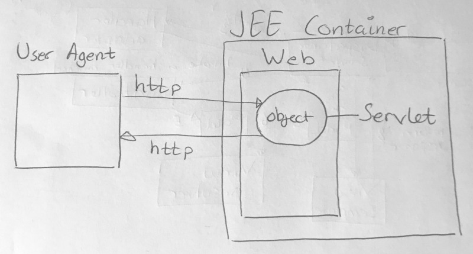
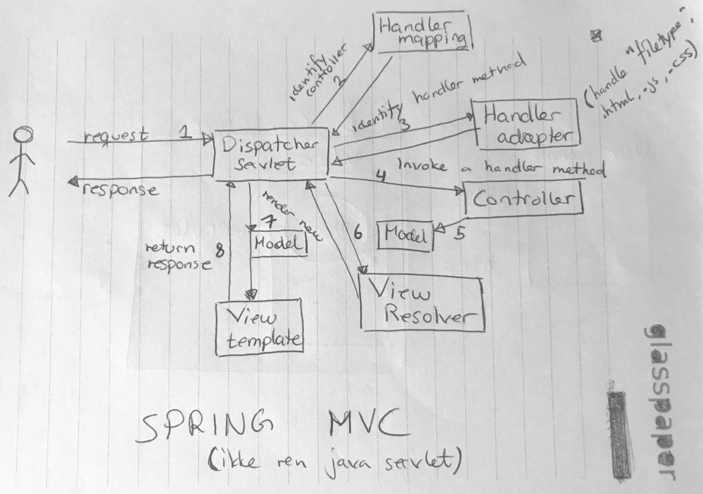

# Spring Core course notes
Spring core is basically just an implementation of the "inversion of control" principle. This can be expressed, either through xml or annotations. The beans generated by spring can be part of different contexts, these context can be manually created.
## Summary of Spring Core
* __@Value__ is used when simple values or property-file values, e.g String, int, int[] should be injected into the parameter. Default values are written using a `:` like so `@Value("${value.from.file:some default value})`.
    - __SpEL__ Spring Expression Language makes it possible to write a sort of code for setting propertyes. Can also read xxx.properties-values. Se example below.
    ```java
    @Value("#{T(java.lang.Math).random()}")
    private int randomValue;
    ```
    - SpringBoot automatically creates a PlaceHolderConfigurer bean in order to read the properties-files, normal spring doesn't.
    - If we are lazy and don't want to annotate each field / parameter with `@Value` we can use __@ConfigurationProperties(prefix = "..")__, it will match fields by property-name. It's probably better to just use `@Value(..)` though, in order to avoid confusion.
* __@Autowired__ used to autowire Java-beans defined either through xml or via annotations such as @Component, @Service.
* __@Resource__ Spring / JNDI named resources 
* __@PostConstruct__ Should prefer to do initialization logic inside the constructor, but can be useful when we don't have control over the constructor.
* Spring's default scope is __singleton__ -> beans will be reused and live as long as the context they are defined in. __prototype__ scope generates a new bean each time it's used.
* __Eager init__ the deafult initalization method.
* __JUnit__ always uses a "testrunner" in order to run tests, the default being __BlockJunit4ClassRunner__. If the testrunner isn't provided using `@RunWith`, the JUnit-library (or IDE?) will assume that __BlockJunit4ClassRunner__ should be used. In order to access Spring's context in the unit-tests we can use the __SpringJunit4ClassRunner__ implementation.
* __Spring profiles__ is used to dyanmically create beans that are only applicable for certain environments, eg. production and development. In spring boot, when using the `application.properties` a separate file is needed for each profile. When using YAML, the profiles can be separated using three dashes `---`.
* __ApplicationArgument__ is Spring Boot's way of accessing command-line-arguments.

## Data Management
* __@EnableTransactionManagement__ requires a __PlatformTransactionManagement__ which we have to define our selves.
* __LocalTranscation:__ transactions using the same resource, e.g a single database.
* __GlobalTransaction:__ transactions using multiple resources, eg. a database and a queue.
* __@Transactional:__ the annotation must be used on methods that should use Spring's transaction-system, for instance when we want to persist changes on fields of objects that exist in the database. In the example below only the update-method will actually persist the changes to the database due to the `@Transactional`-annotation.
```java
@Transactional
public void update(Person p) {
    Person dbPerson = repository.getById(p.getId());
    dbPerson.setName(p.getName());
}

public void updateNotWorkingCorrectly(Person p) {
    Person dbPerson = repository.getById(p.getId());
    dbPerson.setName(p.getName());
}
```

## Spring MVC
### __Spring MVC Container__

### __Spring MVC Architecture__


* __servlet-context__ defines MVC-related beans, e.g controllers, views and resolvers.
* __root-context__ defines business-beans, e.g services and repositories.
* We don't need to manually define `HandlerMapping` and `HandlerAdapter` when using annotations instead of xml. THe handlers still exist in the system even though we don't manually define them.
* __Pet clinic__ is a sample repo illustrating both xml and annotation setup, it can be found here [Spring MVC petclinic](https://github.com/spring-petclinic/spring-framework-petclinic). There is also a corresponding repo for a reactjs frontend [Petclinic-Reactjs](https://github.com/spring-petclinic/spring-petclinic-reactjs)
* For examples on how to find dependencies and such take a look at [MVC Showcase](https://github.com/spring-projects/spring-mvc-showcase)
* Useful Spring boot links: [Spring boot](http://spring.io/projects/spring-boot)
* For metrics, health monitoring and such look at the spring-boot-actuator project.

## Spring Security
* __@PreAuthorize__ used to annotate methods / classes to furhter specify user-access to the given feature.
```java
@PreAuthorize("hasRole(ADMIN)")
public ModelAndView userManagementPage() {...}
```

## AoP 
* __@PointCut__ is the same as creating a variable containing a filter instead defining the same filter for each use: 
```java
@PointCut(“execution(set*(*))”) 
public void setterPointCut() {..}

@Before("setterPointCut")
public void logChange(JoinPoint jp) {..}
```
* The __JoinPoint__ object provides us with information regarding the function vi are AoP'ing. Look at the example above.


