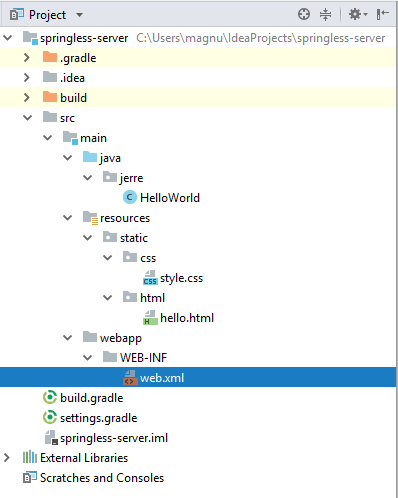

## Folder structure of a standard web-server application, i.e *.war
```
war-file-name.war
---: META-INF
    ---> MANIFEST.MF
---: WEB-INF
    ---> web.xml
    ---: classes
        ---: jerre      //one or more package names
            ----> HelloWorld.class //one or more class-definitions.
        ---: static     //standard java folder structure for the resource-folder is spread here
            ---: html
                ---> hello.html
            ---: css
                ---> style.css
    ---: libs   //only necessary if there are any jar-files needed
        ---> servlet-api-2.5.jar    //one or more jar-files
```


## Gradle war project structure


Note that the __webapp__ folder is directly under main, this is what the *gradle war plugin* expects.